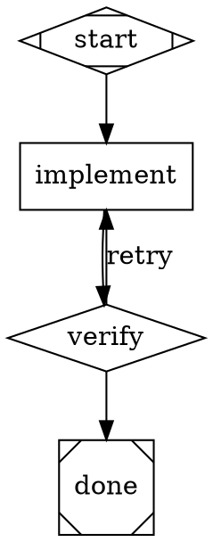
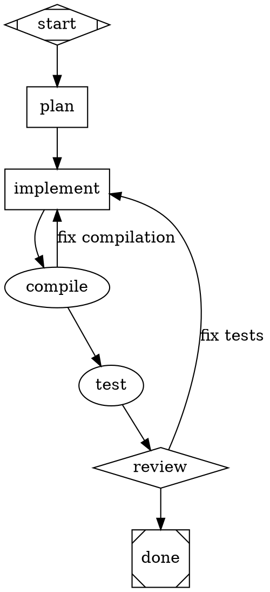

# AGENTS.md — Building Software with Arbor Orchestrator Pipelines

This document explains how AI agents should use the Arbor pipeline engine to build software. The orchestrator parses DOT digraph files into directed graphs and executes them node-by-node, where each node is a task dispatched to an LLM backend.

## Quick Start

```bash
# 1. Create a pipeline from a description
mix arbor.pipeline.new --idea "Build a REST API with authentication"

# 2. Validate the DOT file
mix arbor.pipeline.validate pipeline.dot

# 3. Visualize it (renders to SVG)
mix arbor.pipeline.viz pipeline.dot

# 4. Run it
mix arbor.pipeline.run pipeline.dot --workdir ./my_project

# 5. Evaluate pipeline quality
mix arbor.pipeline.eval eval-spec.dot

# 6. Auto-generate pipelines from source
mix arbor.pipeline.dotgen --app arbor_orchestrator
```

## How Pipelines Work

A pipeline is a DOT digraph where:
- **Nodes** are tasks (code generation, verification, human review, etc.)
- **Edges** define execution order and conditional routing
- **The engine** walks the graph from the start node to an exit node, executing each node's handler



## DOT File Format

### Graph Declaration

Every pipeline is a `digraph` with an optional `goal` attribute:

```dot
digraph PipelineName {
  graph [goal="What this pipeline should accomplish"]
  // nodes and edges here
}
```

The `goal` attribute is used by goal-gate nodes to verify the pipeline achieves its purpose.

### Graph-Level Attributes

| Attribute | Purpose |
|-----------|---------|
| `goal` | Overall pipeline objective (used by goal gates) |
| `label` | Display name for the pipeline |

### Node Shapes and Handler Types

Each node's `shape` attribute determines which handler executes it:

| Shape | Type | Purpose |
|-------|------|---------|
| `Mdiamond` | start | Entry point. Exactly one required. |
| `Msquare` | exit | Terminal node. At least one required. |
| `box` | codergen | **Primary work node.** Sends `prompt` to the LLM for code generation. |
| `diamond` | conditional | Decision/verification node. Routes via edge conditions. |
| `hexagon` | wait.human | Pauses for human review/input. |
| `parallelogram` | tool | Executes a tool/command directly (compiler, test runner). |
| `component` | parallel | Fan-out: spawns parallel execution branches. |
| `tripleoctagon` | parallel.fan_in | Fan-in: waits for parallel branches to complete. |
| `house` | stack.manager_loop | Manages iterative loops with a work stack. |

If a shape isn't recognized, it defaults to `codergen`.

### Explicit Type Handlers

Use the `type` attribute to invoke meta-handlers:

| Type | Purpose |
|------|---------|
| `pipeline.run` | Execute a sub-pipeline with context isolation |
| `pipeline.validate` | Parse and lint a DOT source from context |
| `file.write` | Write context data to a file on disk |
| `eval.dataset` | Load a JSONL dataset into context |
| `eval.run` | Run subject against samples, apply graders |
| `eval.aggregate` | Compute metrics over eval results |
| `eval.report` | Format and output eval report |

### Node Attributes

| Attribute | Type | Default | Description |
|-----------|------|---------|-------------|
| `shape` | string | `"box"` | Handler type (see table above) |
| `type` | string | `""` | Explicit type override (bypasses shape) |
| `prompt` | string | `""` | **The instruction sent to the LLM.** Most important for `box` nodes. |
| `label` | string | node ID | Display name |
| `max_retries` | integer | `0` | Retry count on failure |
| `goal_gate` | boolean | `false` | Pipeline must pass this node to succeed |
| `retry_target` | string | `""` | Node ID to jump back to on failure |
| `timeout` | string | `nil` | Duration: `100ms`, `10s`, `5m`, `1h`, `2d` |
| `llm_model` | string | `""` | Model override (e.g., `"sonnet"`, `"opus"`) |
| `simulate` | string | `""` | `"true"` to skip LLM and use simulated output |
| `tool_command` | string | `""` | Shell command for tool nodes |

### Edge Attributes

| Attribute | Type | Default | Description |
|-----------|------|---------|-------------|
| `condition` | string | `""` | Routing condition. Empty = unconditional. |
| `label` | string | `""` | Display label |
| `weight` | integer | `0` | Priority (higher = preferred) |

### Condition Syntax

Conditions evaluated against node outcomes:

```
outcome=success     # outcome status equals "success"
outcome=fail        # outcome status equals "fail"
outcome!=success    # outcome status is not "success"
```

### Edge Chains

Multiple nodes can be chained in a single edge statement:

```dot
start -> plan -> implement -> test -> done
```

This creates edges: start->plan, plan->implement, implement->test, test->done.

### Subgraphs

Group related nodes with subgraphs. The subgraph label derives a CSS class applied to child nodes:

```dot
subgraph cluster_backend {
  graph [label="Backend Services"]
  api_handler
  db_layer
}
```

Produces nodes with `attrs["class"] = "backend-services"`.

## Patterns

### SDLC Pipeline (Most Common)

The standard software development lifecycle pipeline:



### Retry Back-Edges

Always include retry edges from quality gates:

```dot
quality [shape=diamond, goal_gate=true, retry_target="implement"]
quality -> done [condition="outcome=success"]
quality -> implement [condition="outcome=fail", label="retry"]
```

### Node Defaults

Set defaults for all subsequent nodes:

```dot
node [shape=box, llm_model="sonnet"]
```

### Tool Nodes

Execute shell commands directly:

```dot
compile [type="tool", tool_command="mix compile --no-deps-check --warnings-as-errors", max_retries=2]
run_tests [type="tool", tool_command="mix test test/ --no-deps-check"]
```

### Multi-Phase Implementation

Split large tasks into sequential implementation nodes:

```dot
impl_core [shape=box, prompt="Implement core data structures"]
impl_logic [shape=box, prompt="Implement business logic using the core structures"]
impl_tests [shape=box, prompt="Write comprehensive tests"]

start -> impl_core -> impl_logic -> impl_tests -> compile
```

### Parallel Execution

Fan-out to parallel branches, then fan-in:

```dot
parallel [shape=component, join_policy="wait_all"]
branch_a [shape=box, prompt="Implement module A"]
branch_b [shape=box, prompt="Implement module B"]
join [shape=tripleoctagon]

parallel -> branch_a
parallel -> branch_b
branch_a -> join
branch_b -> join
```

## Event System

The orchestrator emits events during pipeline execution. Subscribe to receive real-time updates:

```elixir
# Subscribe to all pipeline events
Arbor.Orchestrator.EventEmitter.subscribe()

# Subscribe to a specific run
Arbor.Orchestrator.EventEmitter.subscribe("run-id")

# In a GenServer/LiveView handle_info:
def handle_info({:pipeline_event, %{type: :stage_completed} = event}, state) do
  # Handle stage completion
  {:noreply, state}
end
```

Events emitted: `pipeline_started`, `pipeline_completed`, `pipeline_failed`, `stage_started`, `stage_completed`, `stage_failed`, `stage_retrying`, `goal_gate_retrying`, `checkpoint_saved`.

## Mix Tasks

| Task | Purpose |
|------|---------|
| `mix arbor.pipeline.run FILE` | Execute a pipeline |
| `mix arbor.pipeline.validate FILE` | Validate DOT syntax and structure |
| `mix arbor.pipeline.compile FILE` | Compile to typed IR |
| `mix arbor.pipeline.list` | List available pipeline specs |
| `mix arbor.pipeline.new` | Generate a pipeline from a description |
| `mix arbor.pipeline.viz FILE` | Render pipeline as SVG |
| `mix arbor.pipeline.eval FILE` | Run evaluation pipeline |
| `mix arbor.pipeline.dotgen` | Auto-generate pipelines from source |

## Writing Good Prompts

The `prompt` attribute is the most important part of a `box` node. Guidelines:

1. **Be specific** — Name exact files, modules, and functions
2. **Include context** — Tell the LLM about the project structure
3. **Specify output format** — "Output the COMPLETE file contents"
4. **Reference dependencies** — "Use the Graph struct defined in graph.ex"
5. **Avoid -> in prompts** — The parser may confuse `->` with edge declarations. Use `returns`, `yields`, or `→` (unicode) instead.

### Example Prompt

```dot
implement [
  shape=box,
  prompt="You are working in an Elixir umbrella project.

TASK: Create a Duration parser module.

Module: MyApp.Duration

Parse human-readable duration strings to milliseconds:
  - parse(\"30s\") returns 30_000
  - parse(\"5m\") returns 300_000
  - parse(nil) returns nil

Output the COMPLETE file contents.",
  llm_model="sonnet"
]
```

## Architecture

### Typed Graph IR

The orchestrator uses a two-layer design:
1. **Parser** produces untyped `%Node{id, attrs}` — raw DOT representation
2. **IR Compiler** produces `%TypedNode{handler_type, capabilities, ...}` — validated, typed representation

The IR compiler validates: handler schemas, capability declarations, taint reachability, loop detection, resource bounds, condition completeness.

### Handler Resolution

1. Check explicit `type` attribute
2. Fall back to `shape`-based mapping
3. Default to `codergen`

### Execution Model

The engine walks the graph depth-first:
1. Start at the `Mdiamond` node
2. Execute the current node's handler
3. Evaluate outgoing edge conditions against the outcome
4. Follow the first matching edge (or unconditional edge)
5. Repeat until reaching an `Msquare` exit node

Failed nodes retry up to `max_retries` times. Goal gates can redirect to `retry_target` nodes for broader retry loops.
