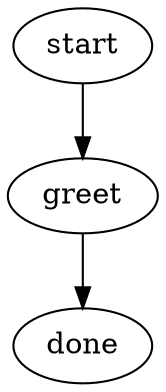
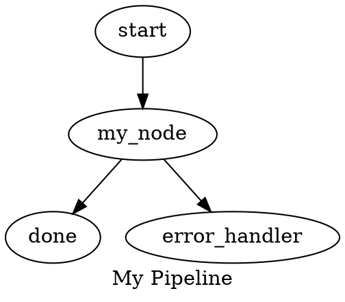
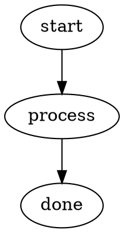
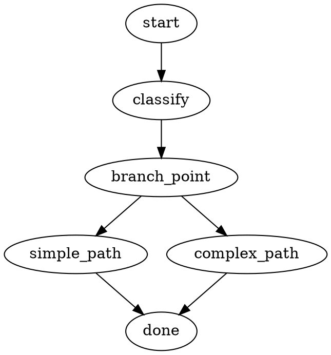
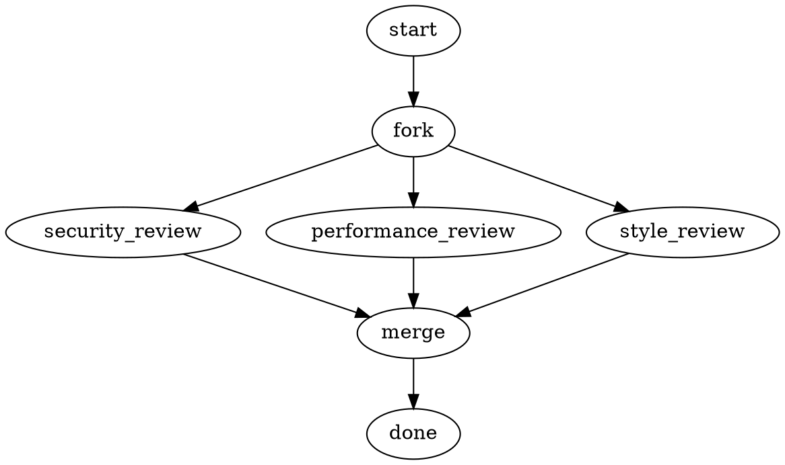
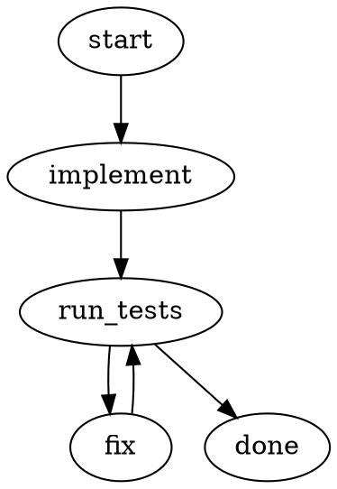
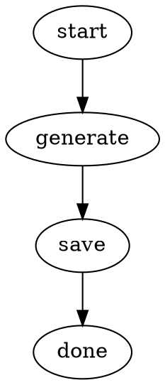
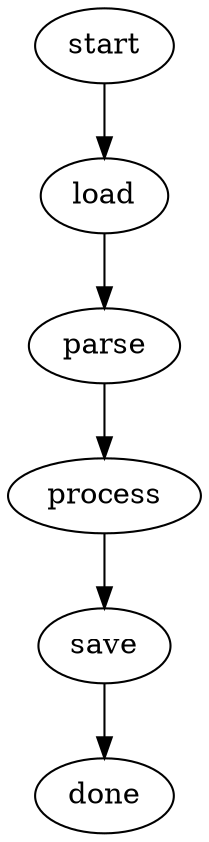
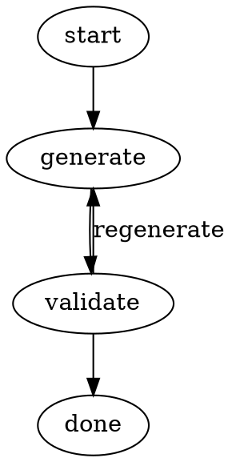

# DOT Pipeline Guide

Comprehensive reference for writing and running Arbor orchestrator pipelines using the DOT graph format.

## Quick Start

A minimal pipeline has three nodes: start, at least one work node, and exit.



Run it:

```bash
mix arbor.pipeline.run hello.dot
```

Set context values at runtime:

```bash
mix arbor.pipeline.run hello.dot --set greeting.style=formal
```

## DOT Syntax

Pipelines use a strict subset of Graphviz DOT. The parser supports `digraph` only (not `graph`).

### Structure



### Comments

```dot
// Line comments
/* Block comments */
```

### Node Attributes

Attributes are key-value pairs in square brackets. Values must be quoted:

```dot
my_node [
  type="compute"
  prompt="Analyze the code in $goal"
  llm_model="claude-sonnet-4-5-20250929"
  temperature="0.7"
  max_tokens="8192"
]
```

### Edge Attributes

Edges support `condition`, `label`, and `weight`:

```dot
a -> b [condition="outcome=success" label="on success"]
a -> c [condition="outcome=fail" label="on failure" weight="10"]
```

### Edge Chains

Multiple edges in a single statement:

```dot
start -> plan -> implement -> test -> done
```

### Graph-Level Attributes

Two equivalent forms:

```dot
// Bare key=value at graph level
goal="My pipeline goal"

// Or inside graph []
graph [goal="My pipeline goal" label="Pipeline Name"]
```

All graph-level attributes are available as `$variable` references in node prompts and labels.

### Variable Expansion

Node `prompt` and `label` fields expand `$variable` references from graph attributes:

| Variable | Source |
|----------|--------|
| `$goal` | `graph.attrs["goal"]` |
| `$label` | `graph.attrs["label"]` |
| `$id` | Graph ID (the digraph name) |
| `$name` | `graph.attrs["name"]` (any graph-level attr) |

Unresolved variables are left as-is.

## The 15 Core Handler Types

All new pipelines should use these canonical types. They are organized into five domains.

### Control Flow

#### `start`

Entry point for pipeline execution. Every pipeline must have exactly one.

| Attribute | Description |
|-----------|-------------|
| _(none required)_ | Simply marks the entry point |

Idempotency: `idempotent`. Aliases: _(none)_.

#### `exit`

Terminal point for pipeline execution. Every pipeline must have exactly one.

| Attribute | Description |
|-----------|-------------|
| `goal_gate` | `"true"` to enable goal-gate checking (retry on unmet goals) |
| `retry_target` | Node ID to retry if goal gate fails |

Idempotency: `idempotent`. Aliases: _(none)_.

#### `branch`

Conditional branching point. The engine evaluates outgoing edge conditions to select the next path.

| Attribute | Description |
|-----------|-------------|
| _(none required)_ | Branch logic lives on the outgoing edges, not the node |

Idempotency: `idempotent`. Aliases: `conditional`.

#### `parallel`

Executes multiple branches concurrently. Targets are the unconditional outgoing edges.

| Attribute | Default | Description |
|-----------|---------|-------------|
| `join_policy` | `"wait_all"` | `wait_all`, `first_success`, `k_of_n`, `quorum` |
| `error_policy` | `"fail_fast"` | `fail_fast`, `continue`, `ignore` |
| `max_parallel` | _(unlimited)_ | Maximum concurrent branches |
| `join_target` | _(auto)_ | Explicit fan-in node ID |

Idempotency: `side_effecting`. Aliases: _(none)_.

#### `fan_in`

Joins parallel branches. Selects the best result from converging branches using heuristic scoring or optional LLM evaluation.

| Attribute | Description |
|-----------|-------------|
| `prompt` | Optional LLM prompt for intelligent result selection |

Idempotency: `side_effecting`. Aliases: `parallel.fan_in`.

### Computation

#### `compute`

General-purpose computation node. Dispatches by `purpose` attribute. Default purpose is `llm` (LLM call via CodergenHandler).

| Attribute | Default | Description |
|-----------|---------|-------------|
| `purpose` | `"llm"` | `llm`, `routing`, `eval_run`, `eval_aggregate` |
| `prompt` | _(required for llm)_ | The prompt sent to the LLM |
| `system_prompt` | _(optional)_ | System prompt for the LLM |
| `llm_provider` | _(from env)_ | Provider name (e.g., `openrouter`, `anthropic`) |
| `llm_model` | _(from env)_ | Model identifier |
| `temperature` | `"0.7"` | Sampling temperature |
| `max_tokens` | _(provider default)_ | Maximum response tokens |
| `max_turns` | `"1"` | Tool-use loop iterations |
| `use_tools` | `"false"` | Enable tool access |
| `tools` | _(all)_ | Comma-separated tool whitelist |
| `simulate` | `"true"` | `true` (mock), `false` (real), `fail`, `retry`, `fail_once` |
| `timeout` | `"120000"` | LLM call timeout in ms |
| `reasoning_effort` | _(none)_ | `low`, `medium`, `high` (for supported models) |

Idempotency: `idempotent_with_key`. Aliases: `codergen`, `routing.select`, `eval.run`, `eval.aggregate`.

#### `transform`

Pure data transformations. No side effects, no I/O.

| Attribute | Default | Description |
|-----------|---------|-------------|
| `transform` | `"identity"` | `identity`, `json_extract`, `template`, `map`, `filter`, `format`, `split`, `join` |
| `source_key` | `"last_response"` | Context key to read input from |
| `output_key` | `"transform.<node_id>"` | Context key to write result to |
| `expression` | _(varies)_ | Transform-specific expression (JSON path, template string, etc.) |

Idempotency: `idempotent`. Aliases: _(none)_.

#### `exec`

Side-effecting execution. Dispatches by `target` attribute.

| Attribute | Default | Description |
|-----------|---------|-------------|
| `target` | `"tool"` | `tool`, `shell`, `action`, `function` |
| `tool_command` | _(for shell)_ | Shell command to execute |
| `tool_name` | _(for tool)_ | Tool function name |
| `action_name` | _(for action)_ | Arbor action module name |
| `sandbox` | `"true"` | Enable sandboxed execution |
| `max_retries` | `"0"` | Retry count on failure |
| `retry_target` | _(none)_ | Node ID to jump to on failure |

Idempotency: `side_effecting`. Aliases: `tool`, `shell`.

### State I/O

#### `read`

Read operations. Dispatches by `source` attribute.

| Attribute | Default | Description |
|-----------|---------|-------------|
| `source` | _(required)_ | `memory`, `eval_dataset`, `file`, `context` |
| `op` | _(varies)_ | Memory operation: `recall`, `working_load`, `stats`, `recall_store` |
| `source_key` | _(varies)_ | Key to read from |
| `output_key` | `"last_response"` | Context key for read result |

Idempotency: `read_only`. Aliases: `memory.recall`, `memory.working_load`, `memory.stats`, `memory.recall_store`, `eval.dataset`.

#### `write`

Write operations. Dispatches by `target` attribute.

| Attribute | Default | Description |
|-----------|---------|-------------|
| `target` | _(required)_ | `memory`, `file`, `accumulator`, `eval` |
| `op` | _(varies)_ | Memory operation: `consolidate`, `index`, `working_save`, `store_file` |
| `mode` | `"overwrite"` | `overwrite` or `append` (for file/accumulator) |
| `output_path` | _(for file)_ | File path to write to |
| `source_key` | `"last_response"` | Context key containing data to write |

Idempotency: `side_effecting`. Aliases: `file.write`, `memory.consolidate`, `memory.index`, `memory.working_save`, `memory.store_file`, `accumulator`, `eval.persist`, `eval.report`.

### Composition

#### `compose`

Nested graph/pipeline execution. Dispatches by `mode` attribute.

| Attribute | Default | Description |
|-----------|---------|-------------|
| `mode` | _(required)_ | `invoke`, `compose`, `pipeline`, `manager_loop` |
| `graph_path` | _(for invoke/compose)_ | Path to the nested DOT file |
| `pipeline_path` | _(for pipeline)_ | Path to pipeline DOT file |
| `max_iterations` | _(for feedback)_ | Loop iteration limit |

Idempotency: `side_effecting`. Aliases: `graph.invoke`, `graph.compose`, `pipeline.run`, `stack.manager_loop`, `consensus.*`, `session.*`, `feedback.loop`, `prompt.ab_test`, `drift_detect`, `retry.escalate` (stdlib DOT invocations).

#### `map`

Batch processing. Iterates over a collection, applies a handler to each element.

| Attribute | Default | Description |
|-----------|---------|-------------|
| `source_key` | _(required)_ | Context key containing the collection |
| `item_key` | `"item"` | Context key for current item |
| `index_key` | `"index"` | Context key for current index |
| `result_key` | `"result"` | Context key for item result |
| `collect_key` | `"map_results"` | Context key for collected results |
| `max_concurrency` | `"1"` | Parallel item processing |
| `on_item_error` | `"skip"` | `skip`, `fail`, `collect_nil` |
| `handler_type` | _(required)_ | Handler type string for per-item processing |
| `handler_attrs` | _(optional)_ | JSON attrs for per-item handler |

Idempotency: `side_effecting`. Aliases: _(none)_.

#### `adapt`

Self-modifying pipeline control. Applies JSON mutations to the running graph. Trust-tier constrained.

| Attribute | Default | Description |
|-----------|---------|-------------|
| `mutations` | _(static JSON)_ | Inline mutation instructions |
| `mutations_key` | _(context key)_ | Dynamic mutations from context |
| `max_mutations` | `"10"` | Maximum mutations per execution |
| `dry_run` | `"false"` | Preview mutations without applying |
| `trust_tier` | `"trusted"` | Required trust tier |

Idempotency: `side_effecting`. Aliases: `graph.adapt`.

### Coordination

#### `wait`

Pipeline pause/coordination. Dispatches by `source` attribute.

| Attribute | Default | Description |
|-----------|---------|-------------|
| `source` | `"human"` | `human`, `timer`, `signal` |
| `question` | _(for human)_ | Prompt shown to the human |
| `duration` | _(for timer)_ | Wait duration (e.g., `"30s"`, `"5m"`) |
| `signal_topic` | _(for signal)_ | Signal topic to wait for |
| `timeout` | _(optional)_ | Maximum wait time |

Idempotency: `side_effecting`. Aliases: `wait.human`.

### Governance

#### `gate`

Validation checkpoint. Blocks pipeline progression if the predicate fails. Does not route — just pass or fail.

| Attribute | Default | Description |
|-----------|---------|-------------|
| `predicate` | _(required)_ | `output_valid`, `pipeline_valid`, `budget_ok`, `expression` |
| `expression` | _(for predicate=expression)_ | Custom validation expression |

Idempotency: `read_only`. Aliases: `output.validate`, `pipeline.validate`.

## Shape Shortcuts

Node shapes provide visual meaning and can set a default type. However, shapes currently resolve to legacy compat type strings, so explicit `type=` attributes are recommended for clarity.

| Shape | Resolves to | Recommended Canonical |
|-------|------------|----------------------|
| `Mdiamond` | `start` | `type="start"` |
| `Msquare` | `exit` | `type="exit"` |
| `diamond` | `conditional` | `type="branch"` |
| `parallelogram` | `tool` | `type="exec" target="tool"` |
| `hexagon` | `wait.human` | `type="wait" source="human"` |
| `component` | `parallel` | `type="parallel"` |
| `tripleoctagon` | `parallel.fan_in` | `type="fan_in"` |
| `house` | `stack.manager_loop` | `type="compose" mode="manager_loop"` |
| `octagon` | `graph.adapt` | `type="adapt"` |
| `box` _(default)_ | `codergen` | `type="compute"` |

A node with no `type` and no recognized shape defaults to `codergen` (compute with LLM).

## Context and Data Flow

### How Data Flows Between Nodes

Each handler writes its output to a context key (default: `last_response`). The next node reads from context to get the previous node's output.

```
[compute A] --writes--> context["last_response"] --read-by--> [compute B]
```

### Custom Keys

Use `output_key` and `source_key` to route data through named channels:

```dot
analyze [type="compute" prompt="Analyze the code" output_key="analysis"]
summarize [type="compute" prompt="Summarize: $last_response" source_key="analysis"]
```

### Context API

The engine maintains a `Context` struct with:
- **`values`** — key-value map of all data
- **`logs`** — accumulated log messages
- **`lineage`** — tracks which node set each key (for debugging)

Common context keys:
- `last_response` — default output from most handlers
- `tool.output` — output from exec/tool handlers
- `$goal` — expanded from graph-level `goal` attribute

### Initial Values

Set initial context values via `--set` or the `initial_values` option:

```bash
mix arbor.pipeline.run pipeline.dot --set model=claude-sonnet-4-5-20250929 --set verbose=true
```

Values are JSON-parsed: `--set count=42` gives an integer, `--set flag=true` gives a boolean.

## Edge Conditions

### Syntax

Conditions are `key=value` or `key!=value` expressions, joined with `&&`:

```dot
// Simple
a -> b [condition="outcome=success"]

// Negation
a -> c [condition="outcome!=success"]

// Compound
a -> d [condition="outcome=success && context.quality=high"]
```

### Valid Keys

| Key | Resolves to |
|-----|------------|
| `outcome` | The handler's outcome status (`success`, `fail`, `retry`, `skipped`, `partial_success`) |
| `preferred_label` | The handler's suggested next edge label |
| `context.KEY` | Any value in the pipeline context |

Values can be bare or quoted: `outcome=success` and `outcome="success"` are equivalent.

### Routing Priority

The engine selects the next edge in this order:

1. **Failure routing** (when `outcome=fail`):
   - Edges whose condition matches the failure
   - Node's `retry_target` attribute
   - Node's `fallback_retry_target` attribute
   - Terminate (no match)

2. **Success routing** (when `outcome=success`):
   - Edges with matching conditions (highest weight wins)
   - Edges matching `preferred_label` (unconditional edges only)
   - Edges matching `suggested_next_ids`
   - First unconditional edge (by weight, then lexical order)

### Weight

Higher weight = higher priority when multiple edges match:

```dot
a -> b [condition="outcome=success" weight="10"]
a -> c [condition="outcome=success" weight="1"]
// b is chosen because weight 10 > weight 1
```

## Common Patterns

### Linear Pipeline

The simplest pattern: start, work, finish.



### Conditional Branching

Use a `branch` node with condition edges:



### Parallel Fan-Out / Fan-In

Execute branches concurrently and merge results:



### Retry Loop

Retry on failure with a fix step:



### LLM + File Output

Generate content and write to disk:



### Data Transformation

Read, transform, and write:



### Gate Check

Validate before proceeding:



## Running Pipelines

### CLI

```bash
# Basic execution
mix arbor.pipeline.run pipeline.dot

# With context values
mix arbor.pipeline.run pipeline.dot --set model=claude-sonnet-4-5-20250929

# Custom log directory
mix arbor.pipeline.run pipeline.dot --logs-root /tmp/my-run

# Set working directory for shell handlers
mix arbor.pipeline.run pipeline.dot --workdir ./my_project

# Resume from last checkpoint (skips unchanged nodes via content-hash)
mix arbor.pipeline.run pipeline.dot --resume

# Resume from a specific checkpoint file
mix arbor.pipeline.run pipeline.dot --resume-from /path/to/checkpoint.json
```

### CLI Options

| Option | Description |
|--------|-------------|
| `--set key=value` | Set initial context values (repeatable). Values are JSON-parsed. |
| `--logs-root DIR` | Directory for pipeline execution logs |
| `--workdir DIR` | Working directory for shell/exec handlers |
| `--resume` | Resume from last checkpoint, skipping unchanged nodes |
| `--resume-from PATH` | Resume from a specific checkpoint file |

### Programmatic API

```elixir
# From a DOT string
{:ok, result} = Arbor.Orchestrator.run(dot_source, opts)

# From a file
{:ok, result} = Arbor.Orchestrator.run_file("pipeline.dot", opts)

# With options
{:ok, result} = Arbor.Orchestrator.run_file("pipeline.dot",
  initial_values: %{"model" => "claude-sonnet-4-5-20250929"},
  logs_root: "/tmp/run",
  workdir: "./project",
  on_event: &handle_event/1,
  on_stream: &handle_stream/1,
  validate: true
)
```

### Result Structure

```elixir
%{
  completed_nodes: ["start", "plan", "implement", "done"],
  final_outcome: %Outcome{status: :success, ...},
  context: %Context{values: %{...}, ...}
}
```

### Runtime Attribute Override

Graph attributes set at the DOT level can be overridden at runtime via `initial_values`. This is useful for injecting provider, model, or prompt values:

```elixir
Arbor.Orchestrator.run_file("advisory-perspective.dot",
  initial_values: %{
    "provider" => "codex_cli",
    "perspective" => "security",
    "question" => "Evaluate the proposal."
  }
)
```

These values are available as `$provider`, `$perspective`, etc. in node prompts via variable expansion.

## Validation

The orchestrator includes 10 built-in lint rules that run before execution.

### Lint Rules

| Rule | Description |
|------|-------------|
| `start_node` | Exactly one start node required |
| `terminal_node` | Exactly one terminal/exit node required |
| `start_no_incoming` | Start node must have no incoming edges |
| `exit_no_outgoing` | Exit node must have no outgoing edges |
| `edge_target_exists` | All edge targets must reference existing nodes |
| `reachability` | All nodes must be reachable from start |
| `condition_syntax` | Edge conditions must have valid syntax |
| `retry_target_exists` | `retry_target` and `fallback_retry_target` must reference existing nodes |
| `goal_gate_has_retry` | Goal gate nodes must have a retry target defined |
| `codergen_prompt` | Compute/codergen nodes must have a prompt |

### Running Validation

Validation runs automatically before `Engine.run`. You can also run it explicitly:

```elixir
{:ok, graph} = Arbor.Orchestrator.Dot.Parser.parse(dot_source)

# Returns list of diagnostics
diagnostics = Arbor.Orchestrator.Validation.Validator.validate(graph)

# Returns :ok or {:error, diagnostics}
:ok = Arbor.Orchestrator.Validation.Validator.validate_or_error(graph)

# Raises on error
Arbor.Orchestrator.Validation.Validator.validate_or_raise(graph)
```

### Excluding Rules

```elixir
Arbor.Orchestrator.Validation.Validator.validate(graph, exclude: ["codergen_prompt"])
```

## Middleware

Middleware runs before and after each node execution. It provides cross-cutting concerns like capability checking, taint tracking, and checkpointing.

### Available Middleware

| Name | Module | Purpose |
|------|--------|---------|
| `capability_check` | CapabilityCheck | Verify agent capabilities |
| `taint_check` | TaintCheck | Track data provenance |
| `sanitization` | Sanitization | Sanitize inputs |
| `safe_input` | SafeInput | Validate input safety |
| `checkpoint` | CheckpointMiddleware | Save/restore state |
| `budget` | Budget | Enforce resource budgets |
| `signal_emit` | SignalEmit | Emit pipeline signals |
| `secret_scan` | SecretScan | Scan for leaked secrets |

### Applying Middleware

At the graph level (applies to all nodes):

```dot
graph [middleware="secret_scan,taint_check"]
```

At the node level:

```dot
my_node [type="compute" prompt="..." middleware="secret_scan"]
```

### Skipping Middleware

```dot
my_node [type="compute" prompt="..." skip_middleware="checkpoint"]
```

### Mandatory Middleware

Seven middleware modules form the mandatory chain (capability, taint, sanitization, safe_input, checkpoint, budget, signal). These are currently feature-flagged off. When enabled via config, they run on every node and cannot be skipped.

## Legacy Aliases

The following type strings are supported for backwards compatibility with existing pipelines. **New pipelines should always use the 15 core types** (`start`, `exit`, `branch`, `parallel`, `fan_in`, `compute`, `transform`, `exec`, `read`, `write`, `compose`, `map`, `adapt`, `wait`, `gate`) with appropriate attributes.

| Legacy Type | Maps To | With Attributes |
|-------------|---------|-----------------|
| `codergen` | `compute` | `purpose="llm"` |
| `conditional` | `branch` | |
| `tool` | `exec` | `target="tool"` |
| `shell` | `exec` | `target="shell"` |
| `file.write` | `write` | `target="file"` |
| `parallel.fan_in` | `fan_in` | |
| `routing.select` | `compute` | `purpose="routing"` |
| `prompt.ab_test` | `compose` | `mode="invoke" graph_file="stdlib/ab-test.dot"` |
| `drift_detect` | `compose` | `mode="invoke" graph_file="stdlib/drift-detect.dot"` |
| `retry.escalate` | `compose` | `mode="invoke" graph_file="stdlib/retry-escalate.dot"` |
| `output.validate` | `gate` | `predicate="output_valid"` |
| `pipeline.validate` | `gate` | `predicate="pipeline_valid"` |
| `wait.human` | `wait` | `source="human"` |
| `accumulator` | `write` | `target="accumulator" mode="append"` |
| `memory.*` | `read`/`write` | Various `source`/`target` + `op` attrs |
| `eval.*` | `read`/`write`/`compute` | Various attrs |
| `consensus.*` | `compose` | _(domain-specific handler)_ |
| `session.*` | `compose` | _(domain-specific handler)_ |
| `graph.invoke` | `compose` | `mode="invoke"` |
| `graph.compose` | `compose` | `mode="compose"` |
| `graph.adapt` | `adapt` | |
| `pipeline.run` | `compose` | `mode="pipeline"` |
| `feedback.loop` | `compose` | `mode="invoke" graph_file="stdlib/feedback-loop.dot"` |
| `stack.manager_loop` | `compose` | `mode="manager_loop"` |

The full mapping is in `Arbor.Orchestrator.Stdlib.Aliases.canonical_type/1`.

**Note:** While the alias layer maps these legacy types to canonical types, the compat handler registry still routes them to their original specialized handler modules. This means `type="codergen"` and `type="compute" purpose="llm"` currently execute through different code paths (CodergenHandler vs ComputeHandler dispatching to CodergenHandler). Both produce the same result; the canonical types with attributes are the forward-compatible approach.
